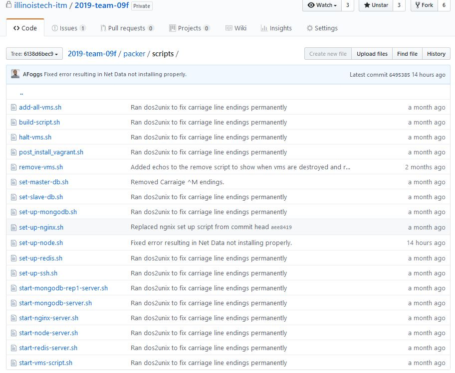
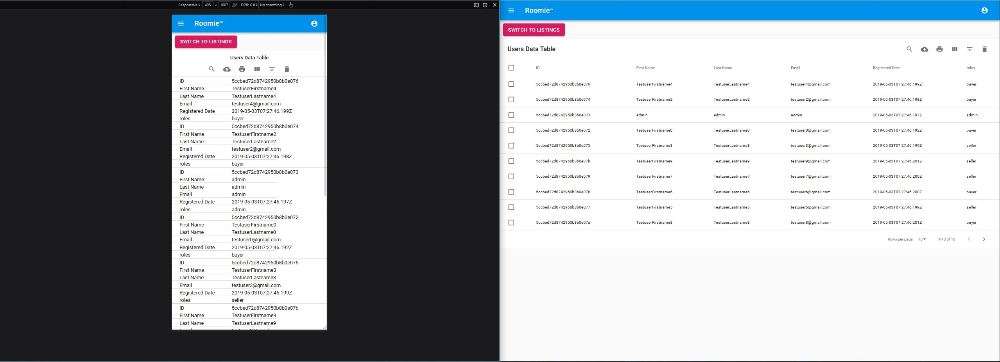
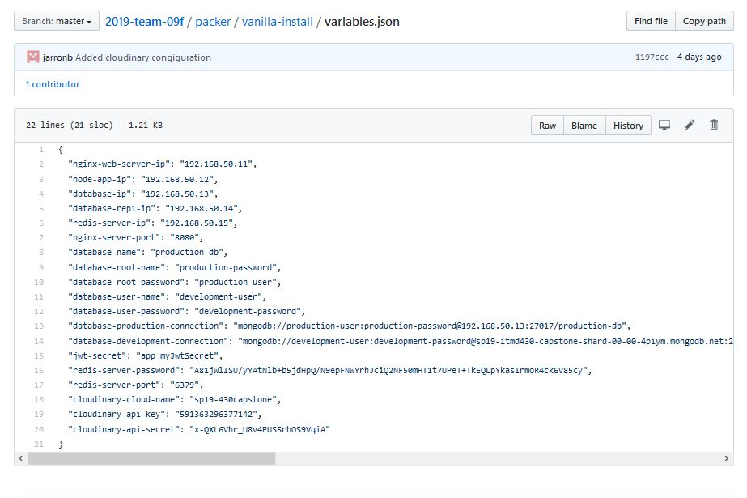

# Sprint 6 Report

## Project Overview

For our project, our intial scope was to create not only a fully working property listing platform, but also a roommate connection framework. After realizing how much of an addition the roommate functionality was, we instead scrapped it and focused on building out the framework for a clean and modern platform where users can be considered buyers or sellers and can view out listings. Sellers would be considered landlords, agents or property managers. Buyers would be considered anyone else. As stated, this would be a two sided market where based on the user attribute, the specific login would be conveyed. Listings would be integrated through our usage of a node JS express API server.

Our focus was to ensure that we incorperated all of the 13 requirements while creating something that could have potential use outside of the classroom. It was a long journey, but we have something that fulfills our basic requirements, that also helped the entire team to learn what it takes to develop an application. Additionally, we created the base of a project that has real world potential, should any of us pursue it further.

## Roles

- Junior Developer - [Giancarlo Barillas](https://github.com/giancarlobarillas)
- IT Ops - [Erick Cabrera](https://github.com/ecabrera796)
- UI/UX - [Jarron Bailey](https://github.com/jarronb)
- Project Manager - [Antoine Foggs](https://github.com/AFoggs)
- Junior Developer - [Theo Economos](https://github.com/teconomo)

## Sprint 6 Goals

- Connect API to work for admin page
- Connect API to listing view
- Connect API to creating a new listing
- Create Template for listing view
- Fully complete out what our home listing view will look like
- Fix out our Photo Upload API for listings
- Insert Test data
- Complete Admin page to contain both User listings as well as Property Listings
- Admin functionality to be able to select, modify and delete listings.
- Redesign homepage and connect all pages to homepage.
- Utilize Material UI to give an enhanced look to our overall structure design
- Fix the listing Creation module to also include file dropzone
- Install resource monitoring tool.
- Create navigation menu for homepage.
- Add pop ups for errors to notify the users
- Test out a global entity for our title font

## Completed goals

- Connect API to listing view
  - Users are now able to view listings that have been created.
- Connect API to create a new listing.
  - Users are now able to create new listings for the platform.
  - File Dropzone component has been added in as well to be able to add in photos for the listing or schematics
- Create Template for listing view.
  - Users are able to complete a basic template in order to upload listings.
- Fully complete out our Admin Page.
  - Admin can see both Users and Properties and select, modify and delete.
- Image Preview
  - Users are able to preview images they upload to see how it looks before uploading listings.
- Install resource monitoring tool
  - [NetData](https://github.com/netdata/netdata) has been utilized to handle resource monitoring. It allows for real time granular monitoring of a servers resources. It collects as much data as possible automatically in real time to allow for accurate diagnosis.
- We couldn't utilize the font we had hoped for as it required payment for personal or commercial license. So we instead fell back on our old one.
- Pop ups were added for better accessability and UX for the user
-

## Sprint 6 Rubric Info

### 1. Language and framework of your choice

The language used throughout the entire developement of the project has been JavaScript in the form of [Nodejs](https://nodejs.org/en/about/), [Expressjs](https://expressjs.com/), and [Reactjs](https://reactjs.org/).

#### Github commits

- Created a sample react app: Commit [e67f0c0866cefbb4e6b4a7347a98dbefeadb92b8](https://github.com/jarronb/2019-team-09f/commit/e67f0c0866cefbb4e6b4a7347a98dbefeadb92b8) - Client directory **_on Mar 11, 2019_**: [Link to directory](https://github.com/jarronb/2019-team-09f/tree/e67f0c0866cefbb4e6b4a7347a98dbefeadb92b8/app/client) - Client directory **_on May 3, 2019_**: [Link to directory](https://github.com/illinoistech-itm/2019-team-09f/tree/6138d6bec980037c7ef64cd7f394ca03bcf0e69c)

- Created script to install dependencies for Development environment & to run react & express development servers concurrently: Commit [8a4d77626111cf2a560d899c027fc6f460f24570](https://github.com/jarronb/2019-team-09f/commit/8a4d77626111cf2a560d899c027fc6f460f24570)

  - Node Express server package.json **_on Mar 11, 2019_**: [Link to file](https://github.com/jarronb/2019-team-09f/blob/8a4d77626111cf2a560d899c027fc6f460f24570/app/server/package.json)
  - Node Express server package.json **_on May 3, 2019_**: [Link to file](https://github.com/illinoistech-itm/2019-team-09f/blob/6138d6bec980037c7ef64cd7f394ca03bcf0e69c/app/server/package.json)
  - Node Express directory **_on May 3, 2019_**: [Link to directory](https://github.com/illinoistech-itm/2019-team-09f/tree/6138d6bec980037c7ef64cd7f394ca03bcf0e69c/app/server)

### 2. Operating System Platform of Choice

- Production OS: Ubuntu 18.04 as primary operating system  
  Why? - Linux has been one of the most stable OS since its creation and have inherent system securities greater than other OS. In addition, linux is usually the OS running on different cloud providers servers which makes more inherent as the go to OS.
- Development OS: Windows 10 and Ubuntu 18.04
- App Metrics w/ [Netdata](https://my-netdata.io/)

#### Github commits

- Netdata setup: Commit [0fb10ee6072f40fa4ce9c12fa770ac6be2c3c198](https://github.com/illinoistech-itm/2019-team-09f/commit/0fb10ee6072f40fa4ce9c12fa770ac6be2c3c198)

- Node set file **_on May 2nd, 2019_**: [Link to file](https://github.com/illinoistech-itm/2019-team-09f/blob/0fb10ee6072f40fa4ce9c12fa770ac6be2c3c198/packer/scripts/set-up-node.sh)

### 3. Use of Data Store/Storage(ITMD 421, ITMD 411, ITMO 456)

- Production database: MongoDB local setup for production
- Development database: MongoDB Atlas cloud setup to cut development startup time

The Mongo Atlas account allowed for the Node app development environment to access a database in the cloud instead of having to start a VM to access the database. This created a easier development environment that didn't consist of starting VMs, since MongoDB in the cloud functions the same way as MongoDB on a locally server. For the Node application, its as easy as switching the MongoDB connection string depending the Node environment.

- Redis Caching server

#### Github commits

- Redis connection: Commit [8b8140e8cb961364d55d4fed5ed1bbb8bcc725c1](https://github.com/illinoistech-itm/2019-team-09f/commit/8b8140e8cb961364d55d4fed5ed1bbb8bcc725c1)

- Variables JSON file **_on Feb 27th, 2019_**: [Link to file](https://github.com/jarronb/2019-team-09f/blob/c621d86b4079f3789dc0d8505ee5cdb467740858/packer/vanilla-install/variables.json)

### 4. Data encrypted at rest(ITMS 448)

- JWT is used track user authentication and permission
- [Bcryptjs](https://www.npmjs.com/package/bcryptjs) is used to hash & salt user sensitive information like passwords transmitted through HTTP

  - **_JWT_** was used for user authentication because they're public/private key pairs. This makes is perfect for authenticating users, and permissions to access routes. From **_https://jwt.io/_**:
    **Authorization**: This is the most common scenario for using JWT. Once the user is logged in, each subsequent request will include the JWT, allowing the user to access routes, services, and resources that are permitted with that token. Single Sign On is a feature that widely uses JWT nowadays, because of its small overhead and its ability to be easily used across different domains.

### 5. Database makes use of master/slave replication (~ITMD 421, ITMD 411)

- In production there is a Master MongoDB server and a Replica that is set to "Read Majority" so that its will create the Master/Slave relationship
- Redis is used as the caching layer as mention above

### 6. Use of Responsive design (where applicable)(ITMD 361, ITMD 362)

- Combining [Reactjs](https://reactjs.org/)(UI develelopment library) & [MaterialUI](https://material-ui.com/) (UI component library), we were able to easily implement responsive design
  

### 7. Use of https (ITMS 448, ITMO 456)

- Created Open SSL self signed certificate. This was done to only allow HTTPS traffic to the application single entry port, the Nginx web server. By doing this, all traffic is either https or private communications between servers which allows for more security layers with the architecture.

- Login: The express sever recieves an JWT encrypted with an 256 bit encytion that has an paylpoad user information. The user information is checked against the database for an existing user or the roles of the current user.

- Presseed of information is done using [Donenv](https://www.npmjs.com/package/dotenv-json)
  

### 8. Use of userauthentication(ITMD 361

- Authenticated users will have access to the apllication
- Unauthenticated will be redirected to login screen

### 9. Creation of Dev Environment(local laptop),(ITMO 456)

- Development environments are built using the dev scripts.  
  Features hot reloading of web page when developing in reactjs and and online database to cut start up time of dev environment.

### 10. Layout design (ITMD 361, 362, ITMM 471)

- Design directory **_on May 3rd, 2019_**: [Link to directory ]https://github.com/illinoistech-itm/2019-team-09f/tree/master/design-files)

### 11. Management of Visio (or comparable) diagram tool of work flow (ITM 301, ITMO 456)

Currently our flowcharts of the application are in the reports and in the images folder. These contain the current database relationships.

### 12. Management of project progress (ITMM 471)

Our Trello is currently accurate with the completed tasks.

### 13. Team must generate at least 15 real “test” userdata that is inserted upon instance creationand proper data to test functionality of a system

Currently we have not implemented our 15 test data since we need to first completely connect the api calls to the react components.

## Trello Board

Screenshots of all completion for Sprint 6:

- Trello 1/3
  

- Trello 2/3
  

- Trello 3/3
  

## Github issues

- Full list of issues in chronological order:

- Issue #1
  

- Issue #2
  

- Issue #3
  

- Issue #4
  

- Issue #5
  

- Issue #6
  

- Issue #7
  

- Issue #8
  

- Issue #9
  

- Issue #10
  

- Issue #11
  

- Issue #12
  

- Issue #13
  

- Issue #14
  

- Issue #15
  

- Issue #16
  

#### Team Members

[Antoine Foggs](https://github.com/AFoggs)

[Theo Economos](https://github.com/teconomo)

[Jarron Bailey](https://github.com/jarronb)

[Erick Cabrera](https://github.com/ecabrera796)

[Giancarlo Barillas](https://github.com/giancarlobarillas)
